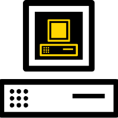

#  Welcome to emuStudio

[](https://www.gnu.org/licenses/gpl-3.0)

[emuStudio](https://www.emustudio.net/) is a desktop application used for computers emulation and writing programs
for emulated computers. It extensible; it encourages developers to write their own computer emulators.

Main goal of emuStudio is support learning about older but important computers, or abstract machines, while
having fun. Nowadays the ability to write programs for old computers is probably not quite interesting for the market,
but I guess emulation has always be more about fun, trying to keeping alive something which was outstanding
in it's peak, and preserve memories.

emuStudio is very appropriate for using at schools, e.g. when students are doing first steps in assembler, or when they
are taught about computers history. For example, emuStudio is used at [Technical University of Košice](http://www.fei.tuke.sk/en)
since 2007.

## Available emulators

* [MITS Altair8800](https://www.emustudio.net/docuser/mits_altair_8800/index/)

* [Manchester SSEM](https://www.emustudio.net/docuser/ssem/index/)

* [Random Access Machine (RAM)](https://www.emustudio.net/docuser/ram/index/)

* [Random Access Stored Program (RASP)](https://www.emustudio.net/docuser/rasp/index/) 

* [BrainDuck (brainfuck interpreter)](https://www.emustudio.net/docuser/brainduck/index/)

## BIG THANKS

Big thanks goes to the one and only [simh](http://simh.trailing-edge.com/) project, which inspired me a lot, and helped
me as a student and emulator enthusiast when working on emuStudio. I wish emuStudio will reach it's simplicity and
emulators "richness" as the simh project has.

## Getting started

At first, either compile or [download](https://www.emustudio.net/download/) emuStudio.
The prerequisite is to have installed **Java Runtime Environment (JRE), at least version 11**
(download [here](https://www.oracle.com/java/technologies/javase-downloads.html)). 

Then, unzip the zip file (`emuStudio-xxx.zip`) and run it using command:

- On Linux / Mac
```
> ./emuStudio
```

- On Windows:
```
> emuStudio.bat
```

NOTE: Currently supported are Linux and Windows. Mac is NOT supported, but it might work to some extent.

For more information, please read [user documentation](https://www.emustudio.net/docs/).

## Contributing

Anyone can contribute. Before start, please read
[developer documentation](https://www.emustudio.net/devel/),
which includes information like:

- Which tools to use and how to set up the environment
- How to compile emuStudio and prepare local releases
- Which git branch to use
- Which rules needs to be followed

### Related projects

There exist some additional projects, which are used by emuStudio, useful for contributors:
  
- [emuLib](https://github.com/emustudio/emuLib), a run-time library
- [edigen](https://github.com/emustudio/edigen), an emulator disassembler generator
- [cpu-testsuite](https://github.com/emustudio/cpu-testsuite), a JUnit-based test suite for comfortable testing of CPU
  plugins
