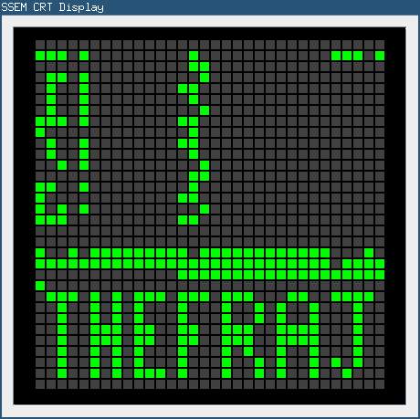

[[DEVICE_HOWTO]]
== Writing a Device

This tutorial will describe how to implement a virtual device to be used in emuStudio. The tutorial
will focus on implementing simple CRT display for SSEM computer.
The main focus is put on how to use emuLib API in a virtual device project so it can be used in emuStudio.

[[DEVICE_GETTING_STARTED]]
=== Getting started

Before reading on, please read the <<INTRODUCTION_PLUGINS>> chapter. It gives the information
needed for setting up the development environment and for basic understanding how the emuStudio/plug-ins lifecycle
work.

In this tutorial we will implement a CRT display for our SSEM computer. It will not completely mimic the real
"monitor" interface with switches and everything, but it will just display the content of the memory. There exist
several good sources about how the real monitor looked like; and with many additional details - just to mention
few:

- http://www.rogerdavies.com/2009/12/manchester-ssem-baby/[Roger Davies nice article about SSEM]
- http://www.cs.ubc.ca/~hilpert/e/SSEM/index.html[Brent Hilpert page about SSEM, including emulator]
- http://www.davidsharp.com/baby/[David Sharp page about SSEM, including emulator]

As we know from <<MEMORY_HOWTO>>, SSEM memory is in fact a 32x32 grid of bits. A memory cell has 4 bytes = 32 bits. So
we have 32 rows or memory cells in the memory, each of size 4 bytes.

Next, the number stored in memory is "reversed" when compared to current x86 numbers representation in memory. It means,
that LSB and MSB were switched. What's more, SSEM used two's complement to represent negative numbers.

With that information, we are able to create the display. For the simplicity, the display will be just a black canvas
with the grid of squares - bits - filled with different color - based on whether the corresponding bit is 1 or 0.

The display should be able to "listen" for memory changes and re-paint itself to be up to date with the current state
of the SSEM memory.

Besides displaying, there will be no other interaction from user.

=== Preparing the environment

In order to start developing the device, create new Java project. Here, Maven will be used for dependencies management.
The plug-in will be implemented as another standard emuStudio plug-in, so it will inherit Maven plug-in dependencies
from the main POM file.

The project should be located at `emuStudio/plugins/devices/ssem-display`, and should contain the following structure:

    src/
      main/
        java/
        resources/
    test/
      java/
    pom.xml

NOTE: Note the naming of the plug-in. It follows the naming convention as described in the <<INTRODUCTION_NAMING>>
      guide.

The POM file of the project might look as follows:

[source,xml]
.`ssem-display/pom.xml`
----
include::../../../plugins/devices/ssem-display/pom.xml[]
----

And let's start with the first Java class, the main plug-in class. Let's put it to package
`net.sf.emustudio.ssem.display`, and call it `DisplaySSEM`.

[[DEVICE_MAIN_CLASS]]
=== The main class

Go to the `DeviceSSEM` class source. Extend the class from `emulib.plugins.devices.AbstractDevice` class.
The abstract class extends from `emulib.plugins.devices.Device` interface and implements the most common methods,
usable by all devices.

It is also necessary to annotate the class with `emulib.annotations.PluginType` annotation, which is required for every
main class of any emuStudio plug-in. The code snippet looks as follows:

[source,java]
.`src/main/java/net/sf/emustudio/ssem/display/DisplaySSEM.java`
----
package net.sf.emustudio.ssem.display;

import emulib.annotations.PLUGIN_TYPE;
import emulib.annotations.PluginType;
import emulib.plugins.memory.AbstractDevice;
import emulib.runtime.ContextPool;

@PluginType(
        type = PLUGIN_TYPE.DEVICE,
        title = "SSEM CRT display",
        copyright = "\u00A9 Copyright 2006-2017, Peter Jakubčo",
        description = "CRT display for SSEM computer."
)
public class DisplaySSEM extends AbstractDevice {
    private final static Logger LOGGER = LoggerFactory.getLogger(DisplaySSEM.class);

    public DisplaySSEM(Long pluginID, ContextPool contextPool) {
        super(pluginID);
    }

    // ... other methods ...
}
----

NOTE: The constructor presented here is mandatory. This is one of the behavioral contracts, emuStudio expects
      that a plug-in will have a constructor with two arguments: `pluginID` (assigned by emuStudio), and a context
      pool, which is a storage or registrar of all plug-ins contexts.

In the initialization phase (see <<INTRODUCTION_INITIALIZATION>>), we need to obtain SSEM memory, which will be used
as the source of information which bits are "turned on":

[source,java]
.`src/main/java/net/sf/emustudio/ssem/display/DisplaySSEM.java`
----
public class DisplaySSEM extends AbstractDevice {
    ...
    private final ContextPool contextPool;

    public DisplaySSEM(Long pluginID, ContextPool contextPool) {
        super(pluginID);
        this.contextPool = Objects.requireNonNull(contextPool);
    }

    @Override
    public void initialize(SettingsManager settings) throws PluginInitializationException {
        super.initialize(settings);
        MemoryContext<Byte> memory = contextPool.getMemoryContext(pluginID, MemoryContext.class);

        if (memory.getDataType() != Byte.class) {
            throw new PluginInitializationException(this, "Expected Byte memory cell type!");
        }
    }

    @Override
    public void showSettings() {
        // we don't have settings GUI
    }

    @Override
    public boolean isShowSettingsSupported() {
        return false;
    }

    @Override
    public void showGUI() {
        // TODO!
    }

    ...
}
----

At first - notice that in the constructor we are not registering any device context. It means that the device does not
provide any interaction with other plug-ins. It is however possible to do it as for any other plug-in.

However, it is not the case the opposite way - the device can (and must) use memory to obtain its contents. It is
very possible to get the memory context from the context pool. This is done in the initialization phase, so it is clear
that `contextPool` is loaded with all available contexts from other plug-ins.

It is a good practice to check whether the data type of the memory cells is as we expect; unfortunately in Java the
generics information does not differentiate a type so we need to do it manually.

Now notice there are two methods dealing with GUI. The first one is `showGUI()` and the second one is `showSettings()`,
which creates a pair with `isShowSettingsSupported()`. In emuStudio, each device plug-in can have a "main GUI window",
which is used primarily for the interaction with user. On the other hand, as it could be noticed in other plug-in types,
each plug-in can have its own "settings" window, which shows specific settings of a plug-in. It is also the case for
the device plug-ins.

=== The GUI

We are nowon the best way to implement the GUI of the dislpay. As it was the case for the SSEM memory GUI, the display
will also use a `javax.swing.JDialog` window for displaying the GUI. Next, the window will contain the canvas - a
`javax.swing.JPanel` - which will paint the grid with the squares. In order to do that, we need to create our own
version of `JPanel`.

NOTE: For better description about how painting of Swing components works, please see
      https://docs.oracle.com/javase/tutorial/uiswing/painting/index.html[this tutorial].

Before that, let's show how we want the result to look like:

==== Display panel

And now we are ready for the source code of the `DisplayPanel`:

[source,java]
.`src/main/java/net/sf/emustudio/ssem/display/DisplayPanel.java`
----
include::../../../plugins/devices/ssem-display/src/main/java/net/sf/emustudio/ssem/display/DisplayPanel.java[lines=20..-1]
----

At first, notice that the display panel has its own memory - we can call it "video memory". It is absolutely not
related to the real hardware, becasuse SSEM didn't have this thing. I decided to introduce the video memory because
when painting, which will occur in UI thread - and often!, don't have to interact with the real SSEM memory,
accessed also by the CPU, in emulation thread. So painting method - the `paintComponent()` - is using this
vide memory to ask whether the bit - or the square - should be green or black, based on whether the memory bit is 1
or 0. Also this fact - bit representation in video memory - is a bit different. Instead of numbers 1 or 0 we store
booleans, which better corresponds to a two-value options.

Except the `paintComponent()`, we can see there to be a `writeRow()` and `clear()` methods. The `writeRow()` method
will be called by a memory listener, which is not now defined. The idea is that when a byte in the SSEM memory changes,
the listener will be notified about the change, which will call the `writeRow` as the consequence.

It means that we will update the whole row - memory cell - even if only part of it had changed. The decision about this
detail is simplicity, the performance can be improved if we update only specific bits.

Method `clear()` will erase the video memory.

==== GUI window

As it was said already, we need to implement a `JDialog` which will contain the display panel. The source code
for the dialog is as follows:

[source,java]
.`src/main/java/net/sf/emustudio/ssem/display/DisplayDialog.java`
----
include::../../../plugins/devices/ssem-display/src/main/java/net/sf/emustudio/ssem/display/DisplayDialog.java[lines=20..-1]
----

In the constructor you can notice that we add the memory listener to the memory which is responsible for updating
the display, as was explained in the previous section.

Also, the interesting method is `reset()`, which causes to at first - clearing the display and then loading it with
new content - by copying the whole memory into the video memory of the display.

=== Wrapping up

The last step is to finish the main class. We need to include and show the display when emuStudio asks for it:

[source,java]
.`src/main/java/net/sf/emustudio/ssem/display/DisplaySSEM.java`
----
include::../../../plugins/devices/ssem-display/src/main/java/net/sf/emustudio/ssem/display/DisplaySSEM.java[lines=20..-1]
----

Notice the method `initialize()` - we added a check whether we are in a no-GUI mode. If yes, we should ignore
all requests for showing the GUI. Otherwise, we will create the display GUI right away, and only once.

The method `showGUI()` will then make the GUI visible - show it.

Now we have finished the last piece of the SSEM computer emulator and it is ready for run.
